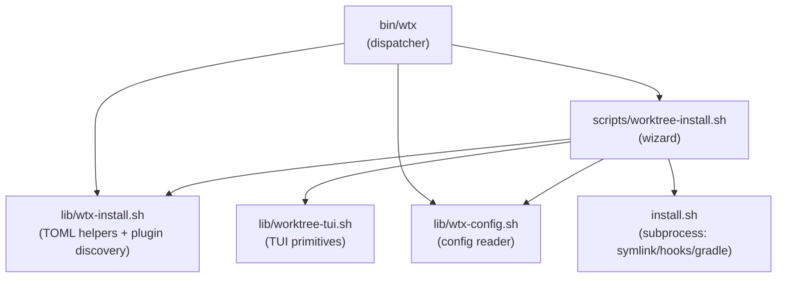
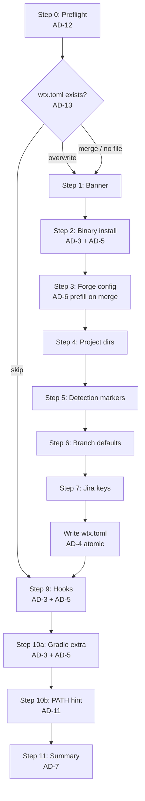

# Architecture Spine — wtx Interactive Installer

## Design Paradigm

**Layered delegation** — each layer calls down, never up; the wizard is the top layer that orchestrates but never reimplements what a lower layer already owns.

```
bin/wtx (dispatcher)
  └─ scripts/worktree-install.sh   ← wizard orchestration (new)
       ├─ lib/wtx-install.sh       ← TOML helpers + plugin discovery (new)
       ├─ lib/wtx-config.sh        ← config reads (existing, unchanged)
       ├─ lib/worktree-tui.sh      ← TUI primitives (existing, unchanged)
       └─ install.sh subprocess    ← symlink / hooks / gradle (existing, unchanged)
```

The wizard is the only new surface visible to users. The layers below it are borrowed — not reimplemented.

## Invariants & Rules

### Dependency direction



No layer may call back up. `install.sh` is always a subprocess, never sourced (its top-level argument parsing has side effects that make sourcing unsafe).

---

### AD-1 — Dispatcher routing

- **Binds:** CAP-1, all
- **Prevents:** a standalone invocation path that resolves WTX_ROOT/WORKSPACE_ROOT differently from the rest of wtx
- **Rule:** `wtx install [--dry-run]` is routed through the `bin/wtx` case statement as `_wtx_exec_script "worktree-install.sh" "$@"` — the same pattern as `start`/`done`/`status`. No alternative entry point. [ADOPTED]

---

### AD-2 — File layout

- **Binds:** all
- **Prevents:** TOML write helpers duplicated between `bin/wtx` and the new wizard; TOML escaping reimplemented independently
- **Rule:** `_wtx_toml_escape` and `_wtx_csv_to_toml_array` are defined in `lib/wtx-install.sh` (with `_WTX_INSTALL_LIB_LOADED` idempotency guard). `bin/wtx` sources `lib/wtx-install.sh` before calling `_wtx_init` (replacing its current inline definitions). `scripts/worktree-install.sh` sources the same lib. No other file may define these functions.

---

### AD-3 — Delegation to install.sh

- **Binds:** CAP-1 (Step 2), CAP-3 (Step 9), CAP-4 (Step 10 — Gradle), CAP-6
- **Prevents:** two implementations of symlink creation / hook copy / Gradle init diverging
- **Rule:** The wizard invokes `install.sh` as a bash subprocess for every file operation it delegates: `bash "$WTX_ROOT/install.sh" --prefix "$WTX_INSTALL_PREFIX"`, `--hooks`, `--gradle`. Never sources `install.sh`. The wizard checks the subprocess exit code and records the result in the ledger (AD-7). In dry-run mode, `--dry-run` is always appended.

---

### AD-4 — Atomic TOML write

- **Binds:** CAP-2, CAP-5 (overwrite and merge paths)
- **Prevents:** a partially written `wtx.toml` on Ctrl-C mid-write leaving an invalid config
- **Rule:** `wtx.toml` is written to `$(mktemp "$WORKSPACE_ROOT/.wtx-install-tmp.XXXXXX")` and moved into place with `mv`. A `trap 'rm -f "$_WTX_INSTALL_TMP"' EXIT` is registered at wizard startup. In dry-run mode the write and mv are skipped; only the `[dry-run] would write:` line is printed.

---

### AD-5 — Dry-run flag propagation

- **Binds:** CAP-6, all write sites
- **Prevents:** dry-run branches scattered with ad-hoc flag checks
- **Rule:** `WTX_INSTALL_DRY_RUN` (0 or 1) is set at preflight from the `--dry-run` argument, exported, and checked by a single `wtx_install_write_or_dryrun <action-label> <cmd...>` helper in `lib/wtx-install.sh`. All install.sh subprocess calls go through this helper. No other code in the wizard checks `--dry-run` directly.

---

### AD-6 — Merge pre-fill via config loader

- **Binds:** CAP-5 (merge path)
- **Prevents:** in-place patch strategies that corrupt the existing file on partial runs; ad-hoc TOML parsing for pre-fill reads
- **Rule:** On the merge path, the wizard sets `WTX_CONFIG="$WORKSPACE_ROOT/wtx.toml"` and re-sources `lib/wtx-config.sh` (resetting `_WTX_CONFIG_LOADED`) before the config prompt loop. Each `tui_input` call receives the current config value as its default argument. The existing file is only replaced when the new file is written atomically (AD-4). [ADOPTED]

---

### AD-7 — Summary ledger

- **Binds:** CAP-7
- **Prevents:** each wizard step independently managing its own display state; Step 11 not knowing what earlier steps did
- **Rule:** The wizard maintains two parallel indexed arrays (bash 3.2 safe, no `declare -A`): `_WTX_LEDGER_KEYS` and `_WTX_LEDGER_VALS`. Each step appends one entry: key = short label (e.g. `symlink`), val = `done`/`skipped`/`failed`. Step 11 iterates both to render the `[✓]/[-]/[!]` summary table. No step prints its own completion status — the ledger owns all summary output.

---

### AD-8 — Plugin discovery

- **Binds:** CAP-1 (Step 8), CAP-2
- **Prevents:** a plugin manifest file that can drift from the actual plugin files in `plugins/`
- **Rule:** `wtx_install_discover_plugins()` in `lib/wtx-install.sh` globs `"$WTX_ROOT/plugins/"*.sh`, reads each file's first line matching `^# wtx-plugin-desc:` (via `grep -m1`), and emits `filename\tdescription` pairs to stdout (newline-separated). When no comment is found, the description defaults to the filename stem. The wizard prepends `None` and `Custom path…` to the list before passing it to `tui_choose`. [ADOPTED]

---

### AD-9 — No config schema extension

- **Binds:** CAP-2, all
- **Prevents:** new TOML keys that `wtx_config_get` callers don't model
- **Rule:** The generated `wtx.toml` contains only the sections and keys present in `wtx.example.toml` as of this spec. No new keys. [ADOPTED]

---

### AD-10 — TUI consistency

- **Binds:** CAP-1, all interactive steps
- **Prevents:** ad-hoc `read` prompts bypassing the gum/bash toggle set in Step 0
- **Rule:** Every interactive prompt in `worktree-install.sh` calls a `tui_*` function from `lib/worktree-tui.sh`. The lib is sourced with the inline stub fallback block (same pattern as all other scripts). No bare `read` calls in wizard prompt code; `read` appears only inside `tui_*` fallback implementations in `worktree-tui.sh`.

---

### AD-11 — PATH hint gate

- **Binds:** CAP-4 (Step 10 — PATH hint)
- **Prevents:** showing a PATH instruction to users who don't need it
- **Rule:** The PATH hint extra is displayed only when `case ":$PATH:" in *":$WTX_INSTALL_PREFIX/bin:"*` does NOT match. When the prefix bin dir is already on PATH, the step is recorded in the ledger as `skipped (already on PATH)` and no prompt is shown. [ADOPTED]

---

### AD-12 — Preflight sequence

- **Binds:** CAP-1 (Step 0), all
- **Prevents:** TUI calls before gum-detection; write operations before dry-run flag is set; prompts before git-repo gate
- **Rule:** Step 0 executes exactly in this order before any `tui_*` call or file write: (1) parse `--dry-run` flag → set `WTX_INSTALL_DRY_RUN`; (2) check git repo (`git rev-parse --git-dir`) → exit 1 with clear message if not in a git repo; (3) detect gum (`command -v gum`) → set `GUM_AVAILABLE` (re-uses the same variable `worktree-tui.sh` consults). No reordering.

---

### AD-13 — Idempotency gate placement

- **Binds:** CAP-5
- **Prevents:** idempotency logic scattered at individual config steps
- **Rule:** The `wtx.toml` existence check and the skip/overwrite/merge prompt happen once, immediately after Step 0 preflight and before Step 1 (welcome banner). On `skip`: load existing values into ledger and jump to Step 9 (hooks). On `overwrite`: continue full wizard with empty defaults. On `merge`: apply AD-6 pre-fill then continue full wizard. This gate is the single branch point for CAP-5.

---

## Consistency Conventions

| Concern | Convention |
| --- | --- |
| Naming — files | `worktree-install.sh`, `wtx-install.sh` — follow existing `worktree-*.sh` / `wtx-*.sh` patterns |
| Naming — functions | `wtx_install_*` prefix for functions in `lib/wtx-install.sh`; `_wtx_install_*` for private helpers in `scripts/worktree-install.sh` |
| Naming — variables | `WTX_INSTALL_*` for exported session vars; `_WTX_INSTALL_*` for script-local state |
| Error output | `printf 'wtx install: %s\n' "..." >&2` — same pattern as `install.sh err()` |
| Optional tool absence | Detected with `command -v <tool>` at the call site; degrades gracefully, never aborts |
| Config reads | `wtx_config_get "section.key" "default"` only; no `grep`/`awk` against `wtx.toml` directly |
| TOML write | `_wtx_toml_escape` for scalars; `_wtx_csv_to_toml_array` for comma-input arrays; both from `lib/wtx-install.sh` |

## Stack

| Name | Version |
| --- | --- |
| bash | 3.2+ (macOS built-in minimum) |
| gum | any (optional; detected at runtime) |
| git | any (required; checked in preflight) |
| install.sh | existing (no version — same checkout) |
| lib/wtx-config.sh | existing (no version — same checkout) |
| lib/worktree-tui.sh | existing (no version — same checkout) |

## Structural Seed

```text
bin/
  wtx                       # +case install → _wtx_exec_script "worktree-install.sh"
                            # +sources lib/wtx-install.sh before _wtx_init

lib/
  wtx-install.sh            # NEW — _wtx_toml_escape, _wtx_csv_to_toml_array,
                            #        wtx_install_discover_plugins,
                            #        wtx_install_write_or_dryrun
                            #        guarded by _WTX_INSTALL_LIB_LOADED

scripts/
  worktree-install.sh       # NEW — wizard orchestration (Steps 0-11)
                            #        sources: wtx-config.sh, worktree-tui.sh,
                            #                 wtx-install.sh
                            #        delegates to install.sh via subprocess
```

Existing files with minimal, non-breaking changes:

```text
bin/wtx
  _wtx_toml_escape()        # MOVED to lib/wtx-install.sh; bin/wtx sources lib
  _wtx_csv_to_toml_array()  # MOVED to lib/wtx-install.sh; bin/wtx sources lib
  _wtx_usage()              # +install in COMMANDS list
  case dispatcher           # +install) → _wtx_exec_script "worktree-install.sh"

install.sh                  # UNCHANGED — wizard calls it as subprocess
lib/wtx-config.sh           # UNCHANGED
lib/worktree-tui.sh         # UNCHANGED
```

## Wizard Flow → AD Coverage



Steps 3–7 use `tui_input` with AD-6 pre-fill on merge; AD-10 governs all of them.
Step 8 (plugin/setup-hook discovery) feeds into Step 7 config block; AD-8 governs it.

## Capability → Architecture Map

| Capability | Lives in | Governed by |
| --- | --- | --- |
| CAP-1 Guided wizard | `scripts/worktree-install.sh` (Steps 0-11 orchestration) | AD-1, AD-10, AD-12 |
| CAP-2 Reference templating | `scripts/worktree-install.sh` + `lib/wtx-install.sh` (TOML write) | AD-2, AD-4, AD-8, AD-9 |
| CAP-3 Hooks setup | `scripts/worktree-install.sh` → `install.sh --hooks` subprocess | AD-3, AD-5 |
| CAP-4 Extras menu | `scripts/worktree-install.sh` (Steps 10a/10b) → `install.sh --gradle` | AD-3, AD-5, AD-11 |
| CAP-5 Idempotency | `scripts/worktree-install.sh` (idempotency gate) | AD-6, AD-13 |
| CAP-6 Dry-run | `lib/wtx-install.sh` (`wtx_install_write_or_dryrun`) + AD-5 threading | AD-5 |
| CAP-7 Completion summary | `scripts/worktree-install.sh` Step 11 + ledger arrays | AD-7 |

## Deferred

| Decision | Reason deferred |
| --- | --- |
| `wtx doctor` check for `lib/wtx-install.sh` | Additive doctor change; story-level detail, no cross-story divergence risk |
| Exact Jira key prompt loop implementation | UX flow spec is the authority; no cross-story conflict possible |
| `tui_style_box` exact string formatting for banner/summary | Cosmetic; `worktree-tui.sh` already owns the API |
| `install.sh` argument interface changes | install.sh is UNCHANGED; any future extension is an install.sh story, not this feature |
| `--uninstall` wizard counterpart | Not in scope (SPEC non-goals) |
| graphify integration | Explicitly excluded in SPEC non-goals |
| CI / automated testing of the wizard flow | No test harness exists for interactive scripts; same deferral as existing scripts |
